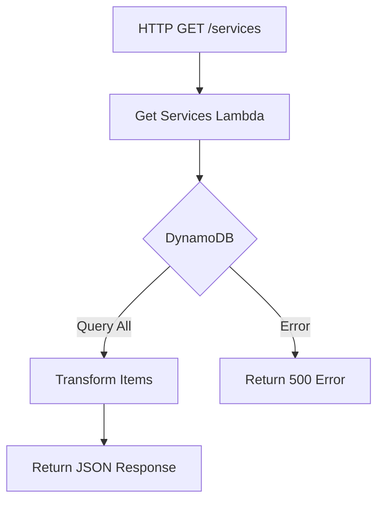
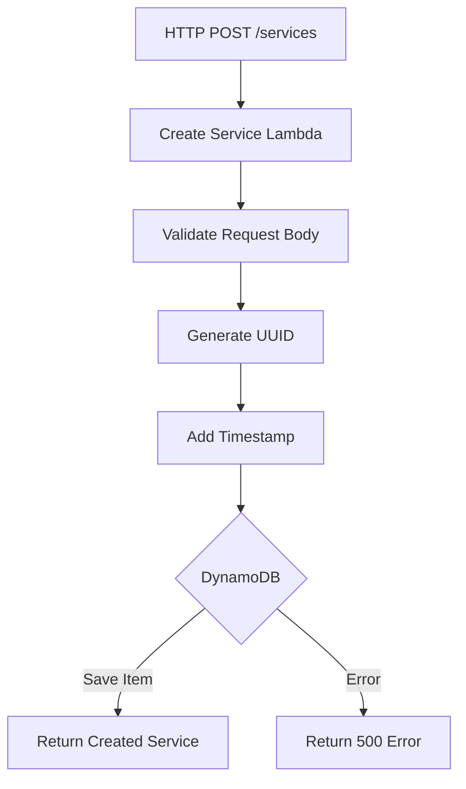

# WM Manager Backend 🚀

Backend service for WM Manager project built with Serverless Framework, Python, and AWS Lambda + DynamoDB.

## 📋 Overview

This project provides a serverless API for managing services with the following operations:
- List all services
- Create new services
- Update existing services
- Delete services

## 🛠️ Tech Stack

- Python 3.12
- Serverless Framework
- AWS Lambda
- Amazon DynamoDB
- CORS enabled for all endpoints

## 🏗️ Project Structure

```
src/
├── lambdas/                 # Lambda function handlers
│   ├── create_service/     
│   ├── delete_service/     
│   ├── get_services/       
│   └── update_service/     
└── lib/                    # Shared utilities and models
    ├── dynamo_connection.py
    ├── models.py
    └── utils.py
```

## 🔧 Setup & Installation

1. Install dependencies:
    ```bash
    npm install
    pip install -r requirements.txt
    ```

2. Setup local DynamoDB:
    ```bash
    serverless dynamodb install
    ```

3. Run locally:
    ```bash
    serverless offline start
    ```

## 🌐 API Endpoints

| Method | Endpoint | Description |
|--------|----------|-------------|
| GET | /services | List all services |
| POST | /services | Create a new service |
| PUT | /services/{id} | Update a service |
| DELETE | /services/{id} | Delete a service |

## 📊 Lambda Functions Flow

### Get Services Flow


### Create Service Flow


### Update Service Flow
```mermaid
flowchart TD
    A[HTTP PUT /services/{id}] --> B[Update Service Lambda]
    B --> C[Extract Service ID]
    C --> D[Validate Request Body]
    D --> E{DynamoDB}
    E -->|Update Item| F[Return Updated Service]
    E -->|Error| G[Return 500 Error]
```

### Delete Service Flow
```mermaid
flowchart TD
    A[HTTP DELETE /services/{id}] --> B[Delete Service Lambda]
    B --> C[Extract Service ID]
    C --> D{DynamoDB}
    D -->|Delete Item| E[Return Success]
    D -->|Error| F[Return 500 Error]
```

## 📝 Environment Variables

- `AWS_REGION`: AWS region for deployment
- `STAGE`: Deployment stage (dev/prod)

## 🔒 IAM Permissions

The service uses an IAM role with permissions to:
- Read/Write to DynamoDB table 'servicos'

## 🌟 Features

- Serverless architecture
- DynamoDB for persistent storage
- UUID-based service identification
- Timestamp tracking for creation
- CORS enabled for frontend integration
- JSON request/response format
- Error handling and validation